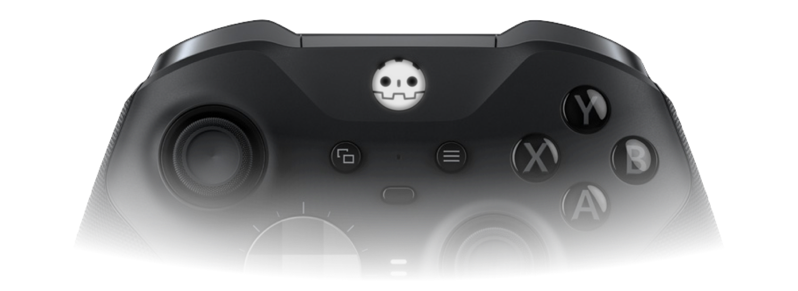

#Launchpad#

**Launchpad** is a small Godot plugin to quickly launch, relaunch or quit your game with your gamepad's home button.

## Installation

1. Download latest release from [here](https://github.com/lullabyist/launchpad/releases/latest) or AssetLib and place it in your project's `addons` folder.

2. In the toolbar, navigate to Project > Project Settings > Plugins and enable Launchpad.

## Usage

* Press your home button to launch the game when editor is in focus.
* Press home when the game is running but editor is in focus to relaunch.
* Press home when game is running and in focus to quit.

## Remap

Simply change the value of `var button` in `launchpad.gd` to any [JoyButton](https://docs.godotengine.org/en/stable/classes/class_%40globalscope.html#enum-globalscope-joybutton). 

## License

Available [here](LICENSE.txt).

## Donation

[<picture><source media="(prefers-color-scheme: dark)" srcset="logo/kofi-dark.svg"></picture>](https://ko-fi.com/E1E8K9QWD)