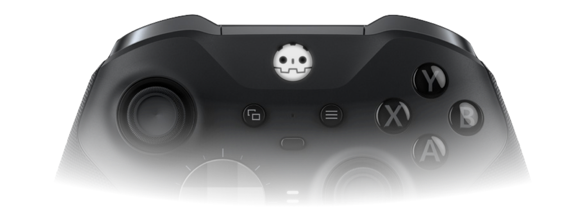

**Launchpad** is a small Godot plugin to quickly launch, relaunch or quit your game with your gamepad's home button.

> [!NOTE]
> Requires Godot 4.2.

## Installation

1. Download latest release from [here](https://github.com/vaner-org/launchpad/releases/latest) or [AssetLib](https://godotengine.org/asset-library/asset/3239) and place it in your project's `addons` folder.
2. In the toolbar, navigate to Project > Project Settings > Plugins and enable Launchpad.
3. If you also have [Launchpin](https://github.com/vaner-org/launchpin) installed, its scene will be preferred.

## Usage

* Press your home button to launch the game when editor is in focus.
* Press home when the game is running but editor is in focus to relaunch.
* Press home when game is running and in focus to quit.

## Configure

In in your project directory's `addons > launchpad > launchpad.gd`, you may
* Change the value of `button` to any other [JoyButton](https://docs.godotengine.org/en/stable/classes/class_%40globalscope.html#enum-globalscope-joybutton).
* Change the value of `use_launchpin` to always run main scene instead of preferring [Launchpin](https://github.com/vaner-org/launchpin)'s scene, if installed.

## License

Available [here](LICENSE.txt).

## Donation

[<picture><source media="(prefers-color-scheme: dark)" srcset="logo/kofi-dark.svg"></picture>](https://ko-fi.com/E1E8K9QWD)